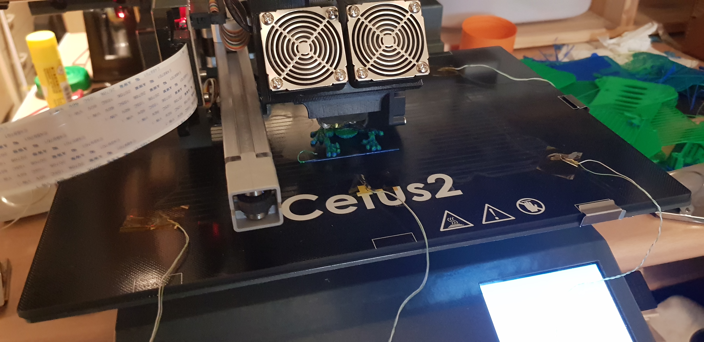
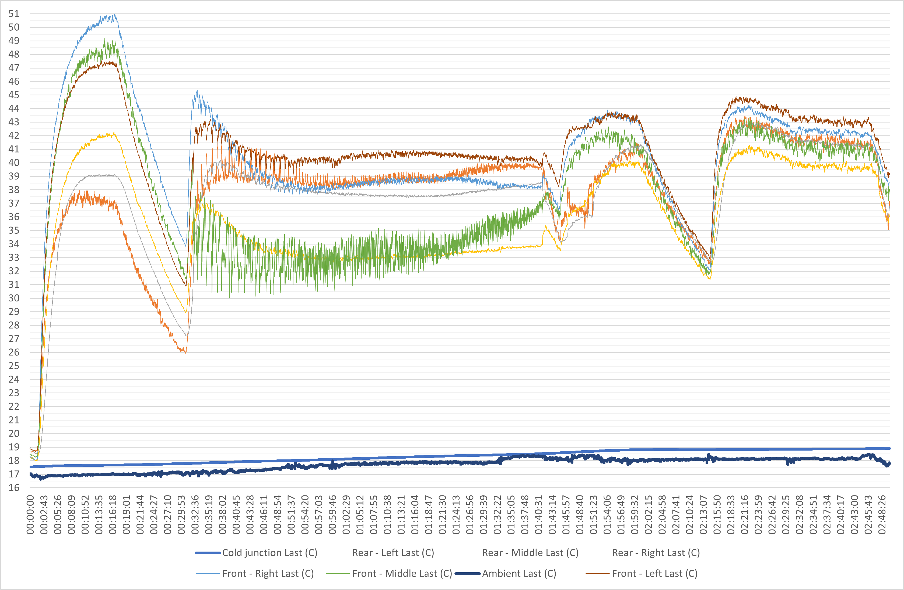

# Cetus2_heatbed_temp
Cetus2 3D Printer, Heatbed Temperature Logging

## Summary
I have recently had my Cetus2 3d printer arrive and following some issues with parts peeling off the bed I thought it would be interesting to use a temperature logger to see how the bed performs. I used a Pico TC8 datalogger with some k-type thermocouples stuck to the glass bed using some kaptan tape. I had initally tried them under the bed but I was worried it was causing some issues due to airgap between the heated bed and the glass.

## Setup Image

## Graph

## What happened
1. Started from Cold, I first asked the Cetus2 to pre-heat the bed.
2. Printed a Frog.
3. Asked to pre-heat the bed again. The fans where causing issues.
4. I unplugged the fans and tried the pre-heat again and this was rather uniform.

## Data
I have saved the data as a csv file and you are welcome to have a look through that.

